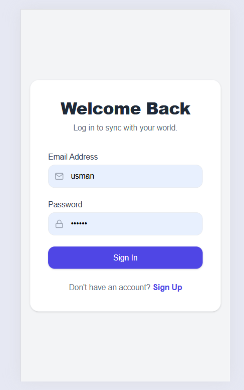
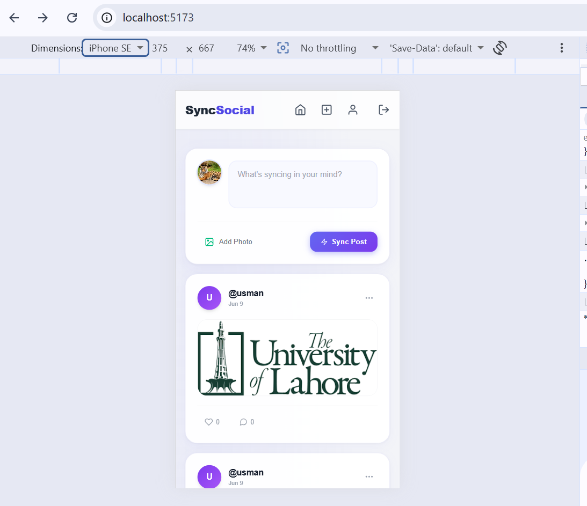
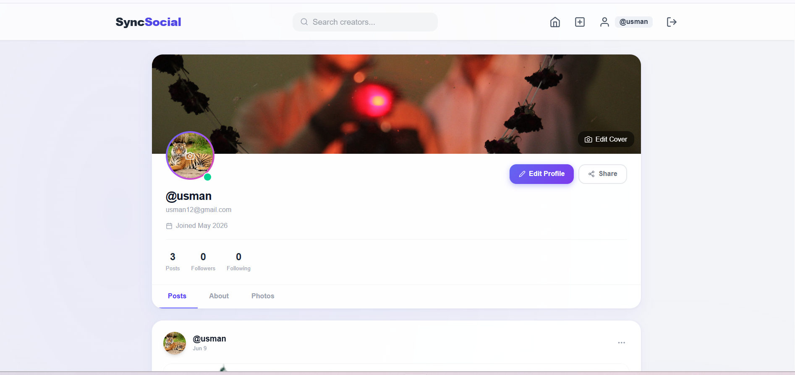
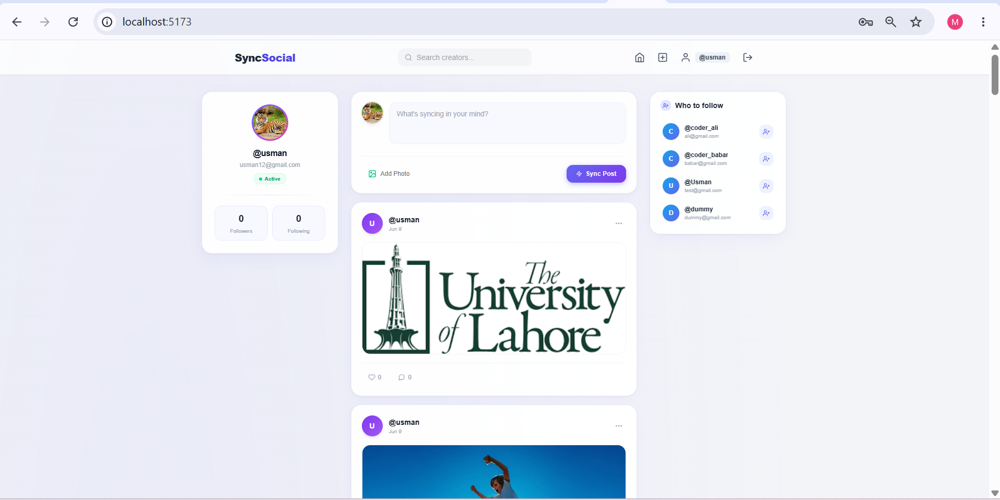

# 🌐 SyncSocial - Full Stack Social Media Application

SyncSocial is a modern, feature-rich full-stack social media web application. Built with the MERN stack, it offers a fast, dynamic, and secure user experience for connecting, sharing posts, and managing profiles.

---

## 📸 Project Screenshots

<table width="100%">
  <tr>
    <td width="50%">
      <p align="center"><b>🔐 Authentication (Login / Register)</b></p>
      
    </td>
    <td width="50%">
      <p align="center"><b>📱 Responsive Mobile View</b></p>
      
    </td>
  </tr>
  <tr>
    <td width="50%">
      <p align="center"><b>👤 User Profile (Avatar & Cover)</b></p>
      
    </td>
    <td width="50%">
      <p align="center"><b>💻 Desktop Feed Layout</b></p>
      
    </td>
  </tr>
</table>

---

## 🚀 Key Features

* **🔒 Secure User Authentication:** Full signup and login system using JSON Web Tokens (JWT) and encrypted passwords.
* **📝 Dynamic Post Management (CRUD):** Users can create, read, update, and delete text posts along with image uploads.
* **📸 Media Uploads:** Handled efficiently using **Multer** for seamless avatar, cover photo, and post image management.
* **❤️ Engagement System:** Real-time like and comment system on user posts.
* **👥 Social Network Architecture:** Fully functional follow and unfollow system to build user connections.
* **👤 Customized Profiles:** Dedicated user profile pages displaying a personalized bio, user avatar, and cover photos.

---

## 🛠️ Tech Stack

### Frontend
* **React.js & Vite:** For a blazing-fast, component-based user interface.
* **TailwindCSS:** For clean, modern, and fully responsive UI layouts.

### Backend & Database
* **Node.js & Express.js:** Scalable and robust RESTful API development.
* **MongoDB:** NoSQL database for flexible data modeling and fast querying.
* **JWT (JSON Web Tokens):** For stateless user session authorization.
* **Multer:** Middleware for handling `multipart/form-data` image uploads.

---

## 📁 Project Structure

```text
sync-social/
├── backend/          # Express Server, Routes, Models, & Controllers
│   ├── middleware/   # Auth & Multer setup
│   ├── models/       # Mongoose Schemas (User, Post)
│   ├── routes/       # API Endpoint declarations
│   └── server.js     # Entry point for backend
└── frontend/         # React + Vite Client
    ├── src/
    │   ├── components/ # Reusable UI elements (Navbar, etc.)
    │   ├── context/    # Global State (AuthContext)
    │   └── pages/      # Feed, Login, Profile pages

⚙️ Local Setup Instructions
Follow these steps to run the project locally on your machine:

1. Clone the Repository
Bash
git clone [https://github.com/usmanmuhammadtech-stack/sync-social_Rhombix.git](https://github.com/usmanmuhammadtech-stack/sync-social_Rhombix.git)
cd sync-social_Rhombix
2. Backend Configuration
Navigate to the backend folder:

Bash
   cd backend
Install dependencies:

Bash
   npm install
Create a .env file inside the backend/ directory and add your credentials:

Code snippet
   PORT=5000
   MONGO_URI=your_mongodb_connection_string
   JWT_SECRET=your_jwt_secret_key
Start the backend server:

Bash
   npm start
3. Frontend Configuration
Open a new terminal and navigate to the frontend folder:

Bash
   cd frontend
Install dependencies:

Bash
   npm install
Start the local development server:

Bash
   npm run dev
👨‍💻 Developer
Muhammad Usman Frontend & Full-Stack Developer GitHub Profile
